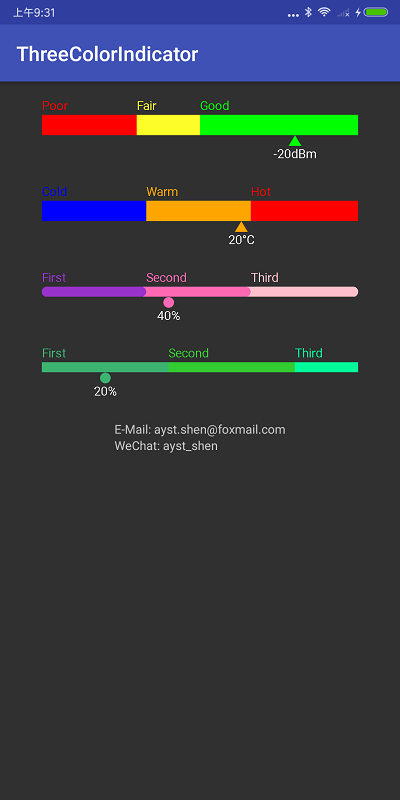

# ThreeColorIndicator

 

This is an Android tri-color progress indicator View.

## Preview

## Using ThreeColorIndicator in your application
### ADT	
	No more support

### Gradle ​ 
Add dependencies in build.gradle of your module:  

	dependencies {
		compile 'com.ayst.tci:threecolorindicator:1.0.3'
	}

## Usage
### Simple Example
	public class MainActivity extends AppCompatActivity {
	
	    private ThreeColorIndicator mThreeColorIndicator;
	
	    @Override
	    protected void onCreate(Bundle savedInstanceState) {
	        super.onCreate(savedInstanceState);
	        setContentView(R.layout.activity_main);
	
	        mThreeColorIndicator = (ThreeColorIndicator) findViewById(R.id.indicator);
	        mThreeColorIndicator.setValue(80);
	    }
	}

### XML Usage
If you decide to use ThreeColorIndicator as a view, you can define it in your xml layouts like this:
 
	<com.ayst.view.ThreeColorIndicator
        android:id="@+id/indicator"
        android:layout_width="match_parent"
        android:layout_height="wrap_content"
        app:tci_min="0"
        app:tci_max="100"
        app:tci_firstColor="@color/red"
        app:tci_secondColor="@color/yellow"
        app:tci_thirdColor="@color/green"
        app:tci_progressHeight="20dp"
        app:tci_progressRadius="0px"
        app:tci_firstRange="30"
        app:tci_secondRange="20"
        app:tci_value="80"
        app:tci_firstText="Poor"
        app:tci_secondText="Fair"
        app:tci_thirdText="Good"
        app:tci_indicatorText="-20dBm"
        app:tci_indicatorTextColor="@android:color/white"
        app:tci_indicatorTextSize="12sp"
        app:tci_indicatorTextWidth="50dp"
        app:tci_indicatorTextHeight="12sp"
        app:tci_indicatorDrawable="@mipmap/ic_three_color_indicator"
        />

NOTE:  

* `tci_firstColor` - First range color
* `tci_secondColor` - Second range color
* `tci_thirdColor` - Third range color
* `tci_max` - Max value
* `tci_min` - Min value
* `tci_value` - Value
* `tci_progressHeight` - Progress bar height
* `tci_progressRadius` - Progress radius
* `tci_firstRange` - This is a percentage, starting with the minimum value, showing first color within this percentage
* `tci_secondRange` - This is a percentage, starting with the first range, showing second color within this percentage
* `tci_firstText` - First Range indicator text
* `tci_secondText` - Second Range indicator text
* `tci_thirdText` - Third Range indicator text
* `tci_indicatorText` - Indicator text
* `tci_indicatorTextColor` - Indicator text color
* `tci_indicatorTextSize` - Indicator text size
* `tci_indicatorTextWidth` - Indicator text width
* `tci_indicatorTextHeight` - Indicator text height
* `tci_indicatorDrawable` - Indicator icon id

## Developed By
* E-Mail: ayst.shen@foxmail.com
* WeChat: ayst_shen

## License
	Copyright(c) 2018 Habo Shen <ayst.shen@foxmail.com>

	Licensed under the Apache License, Version 2.0 (the "License");
	you may not use this file except in compliance with the License.
	You may obtain a copy of the License at

	http://www.apache.org/licenses/LICENSE-2.0

	Unless required by applicable law or agreed to in writing, software
	distributed under the License is distributed on an "AS IS" BASIS,
	WITHOUT WARRANTIES OR CONDITIONS OF ANY KIND, either express or implied.
	See the License for the specific language governing permissions and
	limitations under the License.